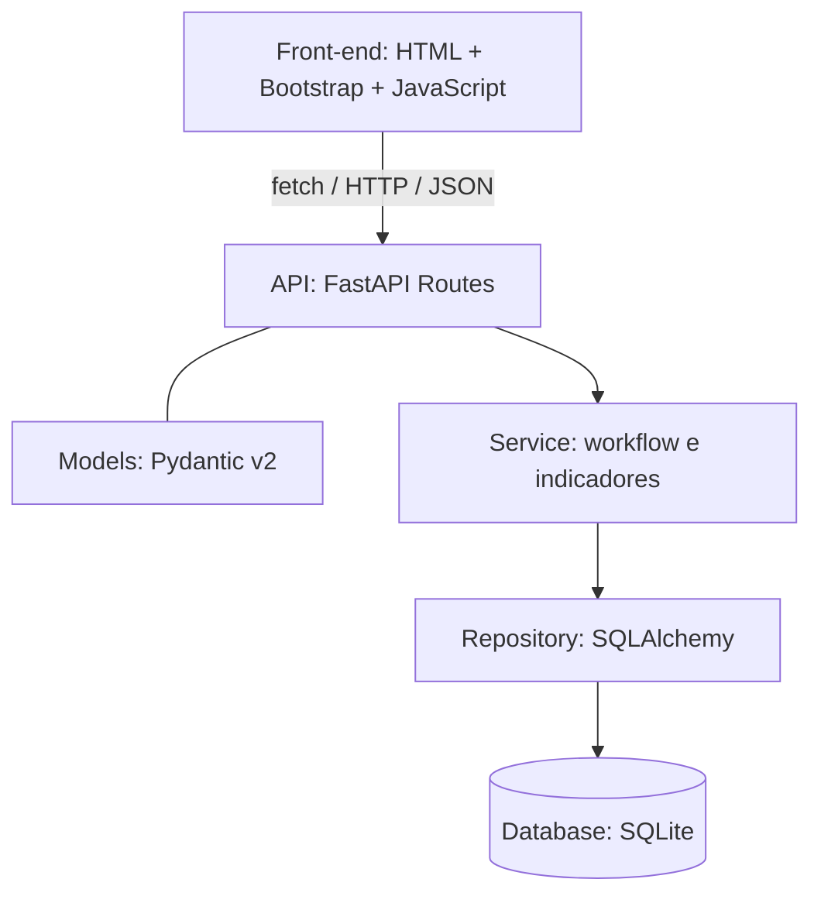

# Monitoramento de Projetos em Workflow

MVP para gerenciar projetos conduzidos por equipes multidisciplinares ao longo do workflow **Seleção → Desenvolvimento → Execução → Pós-venda → Encerrado**. A proposta reúne dados do projeto, equipe responsável, histórico de fases e indicadores operacionais.

> **Status:** estrutura inicial do projeto. O endpoint `GET /health` está disponível; as demais funcionalidades descritas como objetivo e roadmap ainda serão implementadas.

## Objetivo

Construir uma aplicação web para cadastrar, consultar, listar, editar e excluir projetos, acompanhar sua fase atual e registrar cada mudança de fase com data e histórico. Cada projeto deve ter sua equipe informada por texto e permitir acompanhar alvos planejados, clientes sensibilizados, índice de satisfação e taxa de conversão calculada automaticamente.

O escopo e os critérios de aceite estão em [docs/escopo-mvp.md](docs/escopo-mvp.md). As regras de transição e as definições de cálculo dos indicadores ainda serão detalhadas na modelagem; a sequência de fases não define, por si só, todos os movimentos permitidos.

## Stack

- **Back-end:** Python 3.11+, FastAPI e Pydantic v2
- **Persistência prevista:** SQLite e SQLAlchemy
- **Front-end previsto (Estratégia B):** HTML5, CSS3, Bootstrap 5 e JavaScript ES6 com `fetch()`
- **Servidor de desenvolvimento:** Uvicorn
- **Testes previstos:** Pytest
- **Documentação:** Swagger/OpenAPI e Mermaid
- **Versionamento:** Git e GitHub

## Arquitetura proposta

O front-end apresenta telas HTML/Bootstrap e consome a API REST usando JavaScript e `fetch()`. As rotas FastAPI recebem requisições e usam Models Pydantic v2 para validar entradas e respostas. O Service concentra as regras de negócio, transições e cálculo de indicadores; o Repository executa operações de persistência usando SQLAlchemy e SQLite.



Essa organização é a arquitetura prevista para a implementação. Atualmente, o código contém apenas `app/main.py` com o endpoint `/health`; CRUD, banco, histórico, indicadores e interface ainda não foram implementados.

## Pré-requisitos

- Python 3.11 ou superior
- `pip`
- Git (opcional, para obter o código por clone)

## Execução local

O repositório está no início do desenvolvimento e ainda não contém um manifesto de dependências. Os passos abaixo permitem iniciar a aplicação FastAPI atual, disponível em `app/main.py`.

1. Crie e ative um ambiente virtual na raiz do projeto:

   **Windows (PowerShell):**

   ```powershell
   python -m venv .venv
   .\.venv\Scripts\Activate.ps1
   ```

   **Linux ou macOS:**

   ```bash
   python3 -m venv .venv
   source .venv/bin/activate
   ```

2. Instale as dependências mínimas para o endpoint atual:

   ```bash
   python -m pip install fastapi uvicorn "pydantic>=2,<3"
   ```

3. Inicie o servidor na raiz do projeto:

   ```bash
   uvicorn app.main:app --reload
   ```

4. Acesse `http://127.0.0.1:8000/health` para consultar o estado da aplicação. A documentação interativa da API fica disponível em `http://127.0.0.1:8000/docs`.

> SQLAlchemy e Pytest fazem parte da stack prevista, mas ainda não há persistência ou testes implementados. As dependências completas serão registradas em um manifesto durante a implementação. `/health` confirma que a aplicação responde; não verifica o banco de dados.

## Roadmap

- [x] Criar a aplicação FastAPI com `GET /health`.
- [x] Documentar o escopo funcional e as cinco fases do workflow.
- [ ] Definir contratos, transições, política de histórico e regras dos indicadores.
- [ ] Implementar Models, Service, Repository e persistência SQLite com SQLAlchemy.
- [ ] Implementar CRUD de projetos e associação de equipe em texto.
- [ ] Registrar mudanças de fase com data e histórico consultável.
- [ ] Registrar alvos planejados, clientes sensibilizados e satisfação; calcular taxa de conversão.
- [ ] Construir telas de listagem, cadastro, edição e visualização do workflow, histórico e indicadores via `fetch()`.
- [ ] Registrar dependências e instruções definitivas de instalação.
- [ ] Adicionar testes com Pytest para CRUD, workflow, histórico, indicadores e API.

## Fora de escopo

Autenticação, controle de acesso, integrações externas, upload de arquivos, dashboard analítico avançado e IA generativa como funcionalidade do produto. Filtros de busca e contadores agregados ficam como melhorias futuras. A equipe é informada em texto, sem gestão de usuários. A execução inicial é local ou em ambiente interno controlado.

## Contribuição

Durante o desenvolvimento, crie uma branch para sua alteração, mantenha as mudanças focadas e descreva no pull request o que foi alterado e como foi verificado. Instruções específicas de contribuição e testes serão adicionadas conforme a estrutura da aplicação evoluir.
