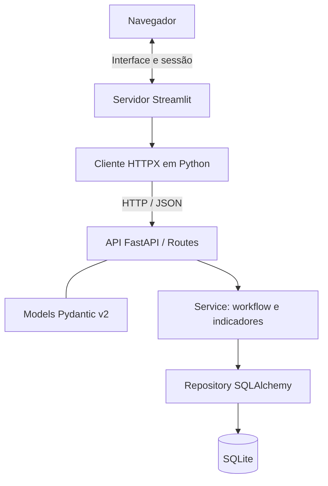

# Monitoramento de Projetos em Workflow

MVP para acompanhar projetos, equipes e indicadores nas fases **Seleção → Desenvolvimento → Execução → Pós-venda → Encerrado**.

> **Estado atual:** API FastAPI, persistência SQLAlchemy/SQLite, interface Streamlit e cliente HTTPX implementados. CRUD, equipe, workflow, histórico e indicadores estão cobertos por testes automatizados. A interface passou por AppTest com respostas simuladas, e as rotas foram verificadas com o cliente HTTP de teste e SQLite temporário; a conferência visual manual no navegador ainda está pendente.

## Objetivo e estratégia adotada

Cadastrar, listar, consultar, editar e excluir projetos; identificar a equipe em texto; acompanhar fase, datas, histórico e indicadores operacionais. A **Nova Estratégia A** usa componentes nativos do Streamlit para priorizar a entrega. A Estratégia B fica para depois do MVP.

O [escopo](docs/escopo-mvp.md) registra RF/RNF e as decisões de modelagem adotadas. O [backlog](docs/backlog.md) organiza Core, Qualidade e Entrega Final. A adoção de Streamlit adapta a orientação original do laboratório, que usa HTML/Bootstrap/JavaScript.

## Stack

- Python 3.11+, FastAPI, Uvicorn e Pydantic v2.
- Streamlit para interface e HTTPX síncrono para comunicação com a API.
- SQLite e SQLAlchemy para persistência.
- Pytest e AppTest para testes; Swagger/OpenAPI e Mermaid para documentação.
- Git/GitHub para versionamento.

As dependências de execução estão em `requirements.txt`; as de desenvolvimento em `requirements-dev.txt`. O ambiente local foi preparado com Python 3.11. As faixas de versão dos manifestos não constituem um lock de todas as dependências transitivas.

## Arquitetura



As camadas de domínio e persistência do diagrama estão implementadas. A interface não importa Service/Repository nem acessa SQLite. As regras e o cálculo de conversão pertencem ao Service; a API valida entradas e devolve dados e transições permitidas. O cliente HTTP centraliza URL, timeout e mensagens de erro, sem repetir automaticamente escritas após timeout.

Formulários enviam dados mediante submissão explícita. O estado de sessão guarda seleção, confirmação e mensagens temporárias; a persistência definitiva é mantida no banco. As consultas começam sem cache. As chamadas HTTP partem do servidor Streamlit e não exigem CORS do navegador nesse fluxo.

## Obter o código

É necessário ter Git instalado e acesso ao repositório GitHub.

Para uma cópia nova:

```bash
git clone https://github.com/Hayltons/UFG_Curso4_Lab02_workflow_projetos.git
cd UFG_Curso4_Lab02_workflow_projetos
```

Para atualizar uma cópia existente na branch principal:

```bash
git switch main
git pull --ff-only origin main
```

## Requisitos e instalação

A aplicação foi verificada com Python 3.11. Instale Python 3.11 ou superior. Todos os comandos a seguir devem ser executados na pasta raiz do projeto.

Crie o ambiente virtual:

```powershell
# Windows PowerShell
py -3.11 -m venv .venv
```

```bash
# Linux ou macOS
python3 -m venv .venv
```

Ative o ambiente virtual:

```powershell
# Windows PowerShell
.\.venv\Scripts\Activate.ps1
```

```bash
# Linux ou macOS
source .venv/bin/activate
```

No Windows, se o PowerShell bloquear a ativação, permita scripts somente no processo atual e tente novamente:

```powershell
Set-ExecutionPolicy -Scope Process -ExecutionPolicy Bypass
.\.venv\Scripts\Activate.ps1
```

Instale a aplicação e as dependências de teste:

```bash
python -m pip install -r requirements-dev.txt
```

Para somente executar a aplicação, instale `requirements.txt` no lugar de `requirements-dev.txt`. Não é preciso configurar um banco externo: a API cria o arquivo local `projects.db` quando iniciar pela primeira vez.

## Iniciar a aplicação

Abra dois terminais na pasta raiz do projeto e ative `.venv` em ambos. Inicie a API no primeiro:

```bash
python -m uvicorn app.main:app --reload --host 127.0.0.1 --port 8000
```

No segundo terminal, configure a URL da API e inicie o Streamlit:

```powershell
# Windows PowerShell
$env:API_BASE_URL = "http://127.0.0.1:8000"
python -m streamlit run frontend/streamlit_app.py --server.address 127.0.0.1 --server.port 8501
```

```bash
# Linux ou macOS
export API_BASE_URL="http://127.0.0.1:8000"
python -m streamlit run frontend/streamlit_app.py --server.address 127.0.0.1 --server.port 8501
```

Abra `http://127.0.0.1:8501` no navegador. A API fica em `http://127.0.0.1:8000`; a documentação interativa está em `http://127.0.0.1:8000/docs`, e o health check em `http://127.0.0.1:8000/health`. Mantenha os dois terminais abertos enquanto usar a aplicação; `Ctrl+C` encerra cada servidor.

A variável `API_BASE_URL` tem padrão `http://127.0.0.1:8000`. `.env.example` é apenas um exemplo de configuração: o projeto não carrega arquivos `.env` automaticamente.

| Endereço | Finalidade e estado |
| --- | --- |
| `http://127.0.0.1:8000/health` | Health check do processo HTTP; não verifica o banco. |
| `http://127.0.0.1:8000/docs` | Documentação interativa dos endpoints da API. |
| `http://127.0.0.1:8501` | Interface Streamlit para os fluxos de projetos. |

A interface usa a API local para ler e salvar os dados. O arquivo `projects.db` é local e está excluído do Git; faça cópia dele caso precise preservar os dados locais ao trocar de máquina.

## Testes

```powershell
python -m pytest -q
python -m pip check
```

Verificação realizada: **42 testes passaram**, cobrindo Service, API, cliente HTTP e interface Streamlit; `pip check` não encontrou conflitos. Os cenários incluem submissão, cancelamento e confirmação de exclusão, dados retornados pela API, erros e ausência de escritas repetidas por reexecução comum.

Ainda falta conferir os fluxos ponta a ponta no navegador e avaliar manualmente teclado e telas pequenas.

## Roadmap

- [x] Aplicação FastAPI com `GET /health`.
- [x] Adotar a Nova Estratégia A no escopo, roteiro e arquitetura.
- [x] Registrar dependências e configuração da interface.
- [x] Criar cliente HTTPX e telas Streamlit.
- [x] Verificar cliente e interface com respostas simuladas.
- [x] Definir contratos e regras de workflow, histórico, conversão e satisfação.
- [x] Implementar Models, Service, Repository, SQLite e rotas de projetos.
- [x] Implementar CRUD, equipe, workflow, histórico e indicadores na API.
- [x] Testar regras, persistência, atomicidade e API.
- [ ] Conferir visualmente a interface no navegador, operação por teclado e telas pequenas.
- [ ] Concluir demonstração e checklist de entrega.

## Próximos Passos — Estratégia B

Após concluir e validar o MVP, migrar a interface para HTML5, CSS3, Bootstrap 5 e JavaScript ES6, consumindo a API FastAPI via `fetch()`. Reutilizar contratos Pydantic, Service, Repository, SQLite e testes do back-end. Preservar CRUD, equipe, workflow, datas, histórico e indicadores.

Refazer telas, navegação, estado e cliente HTTP; definir mesma origem ou CORS; verificar equivalência funcional e atualizar execução e dependências. Retirar Streamlit somente quando todos os fluxos funcionarem na Estratégia B. A troca isolada da interface não exige migração dos dados.

## Fora de escopo

Autenticação, controle de acesso, integrações externas, upload, dashboard analítico avançado e IA generativa como funcionalidade. Filtros e contadores agregados ficam para melhorias futuras. A equipe é texto, sem gestão de usuários. A execução inicial é local ou interna controlada.

## Contribuição

Mantenha alterações focadas e descreva o que mudou e como foi verificado. Diferencie implementação existente, testes com respostas simuladas e funcionalidades ainda planejadas.

## Regras de negócio adotadas

Essas escolhas de modelagem do projeto completam pontos que o material original do laboratório não definiu:

- Projetos começam em Seleção e avançam somente para a fase imediatamente seguinte. Não há repetição, retorno ou salto; Encerrado é terminal.
- A criação registra a entrada inicial em Seleção, com origem nula. A fase, a data e o histórico de cada avanço são gravados na mesma transação. A exclusão remove o histórico associado.
- Conversão = clientes sensibilizados ÷ alvos planejados × 100, arredondada para duas casas decimais com half-up. Com zero alvos, o resultado é nulo; taxas acima de 100% são permitidas.
- Satisfação é opcional, aceita valores de 0 a 10 inclusive. Contagens são inteiros não negativos.

Os valores detalhados, decisões e aceite estão em [docs/escopo-mvp.md](docs/escopo-mvp.md).
