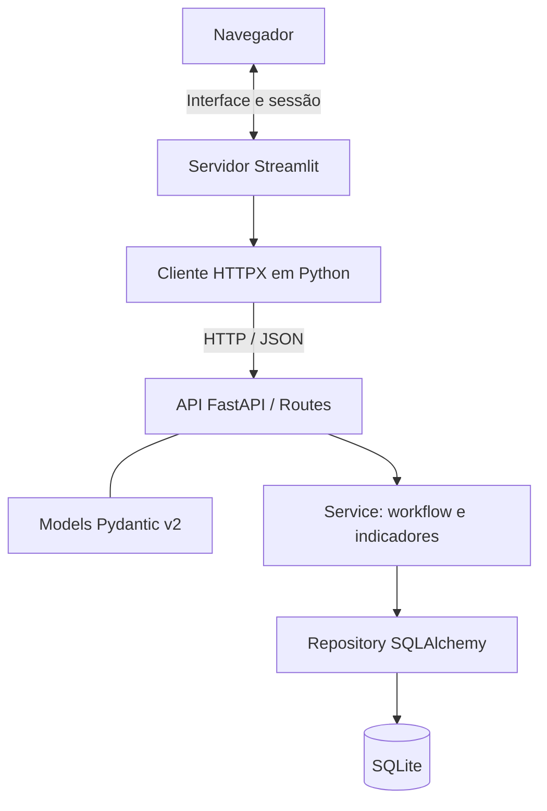

# Monitoramento de Projetos em Workflow

MVP para acompanhar projetos, equipes e indicadores nas fases **Seleção → Desenvolvimento → Execução → Pós-venda → Encerrado**.

> **Estado da Rev1 em 05/10/2026:** CAP03–CAP05 implementaram e validaram as regras e a integração; o usuário aceitou a interface. A versão `0.2.0` foi autorizada e configurada no código da API; `/health` e OpenAPI confirmaram `0.2.0` após reinício, com 1 projeto e 2 eventos preservados. O roteiro foi preparado e o checklist foi aceito; a suíte conjunta passou com 171 testes. A apresentação ficou para depois da publicação, ainda pendente.

> **Estado verificado:** API FastAPI, SQLite Rev1, Streamlit e HTTPX integrados. Passaram 139 testes de backend/inicialização e 32 de cliente/interface em suítes direcionadas, além de 171 testes na suíte conjunta; criação, persistência e reabertura do banco foram conferidas. O usuário aceitou a integração/interface e o checklist. O roteiro foi criado no CAP06-P03; a apresentação ocorrerá após a publicação, enquanto commits e push seguem suas etapas próprias.

## Objetivo e estratégia adotada

Cadastrar, listar, consultar, editar e excluir projetos; identificar a equipe em texto; acompanhar fase, datas, histórico e indicadores operacionais. A **Nova Estratégia A** usa componentes nativos do Streamlit para priorizar a entrega. A Estratégia B fica para depois do MVP.

O [escopo](docs/escopo-mvp.md) registra RF/RNF e as decisões de modelagem adotadas. O [backlog](docs/backlog.md) organiza Core, Qualidade e Entrega Final. A adoção de Streamlit adapta a orientação original do laboratório, que usa HTML/Bootstrap/JavaScript.


### Histórico das decisões de interface

O planejamento inicial adotava a Estratégia B: HTML5, CSS3, Bootstrap 5 e JavaScript ES6 consumindo a API via `fetch()`. Em 02/10/2026, foi adotada e implementada a Nova Estratégia A com Streamlit e HTTPX para priorizar a conclusão do MVP.

Em 03/10/2026, a Rev1 iniciou a revisão de cadastro, indicadores, interface e artefatos, preservando essa arquitetura. As mudanças de aplicação foram executadas nos CAP03–CAP05; os artefatos finais seguem no CAP06. A Estratégia B continua prevista após a conclusão e validação do MVP; sua implementação não faz parte desta revisão.

## Stack

- Python 3.11+, FastAPI, Uvicorn e Pydantic v2.
- Streamlit para interface e HTTPX síncrono para comunicação com a API.
- SQLite e SQLAlchemy para persistência.
- Pytest e AppTest para testes; Swagger/OpenAPI e Mermaid para documentação.
- Git/GitHub para versionamento.

As dependências de execução estão em `requirements.txt`; as de desenvolvimento em `requirements-dev.txt`. O ambiente local foi preparado com Python 3.11. As faixas de versão dos manifestos não constituem um lock de todas as dependências transitivas.

## Arquitetura



As camadas de domínio e persistência do diagrama estão implementadas. A interface não importa Service/Repository nem acessa SQLite. As regras e o cálculo dos indicadores pertencem ao Service; a API valida entradas e devolve dados e transições permitidas. O cliente HTTP centraliza URL, timeout e mensagens de erro, sem repetir automaticamente escritas após timeout.

Formulários enviam dados mediante submissão explícita. O estado de sessão guarda seleção, confirmação e mensagens temporárias; a persistência definitiva é mantida no banco. As consultas começam sem cache. As chamadas HTTP partem do servidor Streamlit e não exigem CORS do navegador nesse fluxo.

## Obter o código

É necessário ter Git instalado e acesso ao repositório GitHub.

Para uma cópia nova:

```bash
git clone https://github.com/Hayltons/UFG_Curso4_Lab02_workflow_projetos.git
cd UFG_Curso4_Lab02_workflow_projetos
```

Para atualizar uma cópia existente na branch principal:

```bash
git switch main
git pull --ff-only origin main
```

## Requisitos e instalação

A aplicação foi verificada com Python 3.11. Instale Python 3.11 ou superior. Todos os comandos a seguir devem ser executados na pasta raiz do projeto.

Crie o ambiente virtual:

```powershell
# Windows PowerShell
py -3.11 -m venv .venv
```

```bash
# Linux ou macOS
python3 -m venv .venv
```

Ative o ambiente virtual:

```powershell
# Windows PowerShell
.\.venv\Scripts\Activate.ps1
```

```bash
# Linux ou macOS
source .venv/bin/activate
```

No Windows, se o PowerShell bloquear a ativação, permita scripts somente no processo atual e tente novamente:

```powershell
Set-ExecutionPolicy -Scope Process -ExecutionPolicy Bypass
.\.venv\Scripts\Activate.ps1
```

Instale a aplicação e as dependências de teste:

```bash
python -m pip install -r requirements-dev.txt
```

Para somente executar a aplicação, instale `requirements.txt` no lugar de `requirements-dev.txt`. Não é preciso configurar um banco externo: a API cria o arquivo local `projects.db` quando iniciar pela primeira vez.

## Iniciar a aplicação

O banco local validado da Rev1 agora se chama `projects.db`, padrão do código. O legado de teste foi excluído e a ferramenta de migração retirada com autorização. Os comandos abaixo iniciam a aplicação pela raiz; em outra máquina, o primeiro startup cria um `projects.db` Rev1 vazio. Consulte [Banco novo da Rev1](docs/banco-novo-rev1.md) para o histórico operacional.

Abra dois terminais na pasta raiz do projeto e ative `.venv` em ambos. Inicie a API no primeiro:

```bash
python -m uvicorn app.main:app --reload --host 127.0.0.1 --port 8000
```

No segundo terminal, configure a URL da API e inicie o Streamlit:

```powershell
# Windows PowerShell
$env:API_BASE_URL = "http://127.0.0.1:8000"
python -m streamlit run frontend/streamlit_app.py --server.address 127.0.0.1 --server.port 8501
```

```bash
# Linux ou macOS
export API_BASE_URL="http://127.0.0.1:8000"
python -m streamlit run frontend/streamlit_app.py --server.address 127.0.0.1 --server.port 8501
```

Abra `http://127.0.0.1:8501` no navegador. A API fica em `http://127.0.0.1:8000`; a documentação interativa está em `http://127.0.0.1:8000/docs`, e o health check em `http://127.0.0.1:8000/health`. Mantenha os dois terminais abertos enquanto usar a aplicação; `Ctrl+C` encerra cada servidor.

A variável `API_BASE_URL` tem padrão `http://127.0.0.1:8000`. `.env.example` é apenas um exemplo de configuração: o projeto não carrega arquivos `.env` automaticamente.

| Endereço | Finalidade e estado |
| --- | --- |
| `http://127.0.0.1:8000/health` | Health check do processo HTTP; não verifica o banco. |
| `http://127.0.0.1:8000/docs` | Documentação interativa dos endpoints da API. |
| `http://127.0.0.1:8501` | Interface Streamlit para os fluxos de projetos. |

A interface usa a API local para ler e salvar os dados. O arquivo SQLite configurado em `DATABASE_URL` é local e deve ficar fora do Git. Depois do início da Rev1, preservar seus dados ao trocar de máquina; o descarte aprovado em D07 se limita ao banco antigo de teste.


### Persistência ao fechar e reabrir

**Os dados confirmados ficam no SQLite e são mantidos ao fechar o navegador, encerrar os servidores, desativar a venv e iniciar novamente.** Para recuperar os mesmos dados, a API deve usar o mesmo arquivo de banco.

O padrão do código é `DATABASE_URL=sqlite:///./projects.db`. O arquivo Rev1 validado foi renomeado para `projects.db` e reaberto sem definir `DATABASE_URL`; o caminho é relativo à pasta de execução da API. Execute pela raiz do repositório ou configure explicitamente a localização desejada. Iniciar em outra pasta pode abrir um banco diferente. A seleção na tela, mensagens temporárias e alterações ainda não submetidas não são persistência de negócio.

`DATABASE_URL` é lida pelo backend; `API_BASE_URL` é lida pelo cliente da interface. O projeto não carrega .env automaticamente. Desativar a venv não apaga o banco. Git pull também não transfere projects.db de outra máquina.

D07 foi executada em partes autorizadas: banco Rev1 criado vazio em arquivo distinto, versão/estrutura/integridade verificadas, API/UI e persistência conferidas, aceite do usuário recebido e legado de teste excluído. O arquivo validado foi renomeado para `projects.db`, preservando 1 projeto fictício e 2 eventos. Nenhum dado legado foi importado; a ferramenta preparada no CAP03-P05 foi retirada no CAP03-P06.

A inicialização cria esquema apenas em banco vazio, reabre banco Rev1 compatível e recusa banco incompatível sem reset automático; esses casos foram verificados no CAP05-P01 e na operação real do CAP05-P03. `create_all()` não converte tabelas antigas. Procedimento e exemplos: [Banco novo da Rev1](docs/banco-novo-rev1.md). Não há recuperação garantida do legado depois do descarte; reexecuções devem preservar os dados novos.

## Testes

```powershell
python -m pytest -q
python -m pip check
```

Verificação histórica da baseline, não reexecutada nesta análise: **42 testes passaram**, cobrindo Service, API, cliente HTTP e interface Streamlit; `pip check` não encontrou conflitos. Os cenários incluem submissão, cancelamento e confirmação de exclusão, dados retornados pela API, erros e ausência de escritas repetidas por reexecução comum.

No CAP05-P01, `139 passed` em bancos isolados; no CAP05-P02, `32 passed` com MockTransport/AppTest. Depois dessas suítes direcionadas, a execução conjunta com `.venv\Scripts\python.exe -m pytest -q` aprovou 171 testes em 7,22 segundos, com quatro avisos de depreciação. No CAP05-P03, API/UI locais, banco vazio, fluxos reais, persistência após reinício e descarte autorizado do legado foram verificados. O usuário aceitou a integração/interface. Nenhum `pip check` novo foi executado nesta revisão.

Além da execução básica histórica, o CAP05-P03 verificou integração HTTP real, persistência após reinício, erros e exclusão; o usuário aceitou a integração/interface após solicitação de avaliação de teclado e tela pequena. Não há gravação independente da sessão visual.

## Revisão 1 — Mudanças implementadas e verificadas

As decisões D01–D08 foram aprovadas e aplicadas nos CAP03–CAP05. Os resultados de testes e integração constam em [revisao-rev1.md](docs/revisao-rev1.md); a entrega documental e Git permanecem nos prompts seguintes.

| Assunto | Resultado Rev1 |
| --- | --- |
| Identificação | Código do projeto NN.NNN e código do subprojeto NN, preservando zeros à esquerda. |
| Cadastro | Códigos e nomes de projeto/subprojeto e edição obrigatórios; nomes até 150, edição até 30 e equipe opcional até 50 caracteres. |
| Descrição | Removida do cadastro/contrato Rev1; dados antigos de teste não foram transferidos. |
| Indicadores | Selecionados/AP>0, Avisados/AS>0 e ≤AP, Descartados/AD>0 e ≤AS informados como inteiros; Estoque=AP−AS e Executados=AS−AD calculados como inteiros e não editáveis. AD=AS é válido e produz Executados=0. |
| Executados | O campo e o rótulo `executados`/Executados substituem o antigo Índice de Satisfação percentual. A nota manual antiga não foi importada. |
| Datas | Previsão opcional; datas de negócio da fase atual e das fases concluídas editáveis, sugeridas pelo UTC. Nova fase ≥ anterior e ≥ hoje; correção histórica entre fases vizinhas. Horários UTC de auditoria imutáveis. |
| Listagem | Todos os campos apresentados; seleção por código, subprojeto e edição para distinguir registros. |
| Fluxos | Cadastro, detalhes, edição, exclusão, workflow, histórico e erros atualizados. |
| Banco | Esquema Rev1 criado vazio, validado, aceito e preservado em `projects.db`; legado de teste excluído por autorização literal. Sem migração ou reset automático. |
| Qualidade | 139 testes de backend/inicialização e 32 de HTTPX/Streamlit passaram separadamente; a suíte conjunta aprovou 171 testes, com quatro avisos de depreciação. Integração HTTP/UI real e persistência após reinício conferidas. |
| Artefatos | README, escopo e backlog Rev1 atualizados; roteiro preparado e checklist aceito. Apresentação prevista para depois da publicação; commits por arquivo são tratados no CAP07-P02 e push no CAP07-P03. |

### Ordem planejada e estado da revisão

1. Aplicar D01–D08 já aprovadas aos documentos de escopo/backlog antes da implementação dependente.
2. Atualizar escopo/backlog e planejar o banco novo conforme D07.
3. Concluir contratos, regras, persistência e API; retirar a ferramenta de migração e ajustar orientação do startup no CAP03-P06.
4. Atualizar cliente HTTPX e todos os fluxos Streamlit.
5. Executar testes isolados, incluindo inicialização/versão e recusa de esquema incompatível.
6. No CAP05-P03, autorizar criação/execução do banco novo, validar a aplicação e, depois, autorizar exclusão do antigo.
7. Corrigir problemas encontrados; conferir teclado, tabela completa e telas pequenas.
8. Consolidar documentação, demonstração e checklist de entrega.
9. Fazer commits por arquivo com Conventional Commits e push mediante autorização.
10. Iniciar o planejamento da Estratégia B após concluir o MVP.

Os passos 1–6 foram executados e validados nos prompts autorizados. O usuário aceitou a integração e a interface; uma checagem visual independente de teclado e telas pequenas não foi registrada. A documentação CAP06-P02 foi aplicada e o CAP06-P03 preparou roteiro/checklist; o checklist foi aceito e a suíte conjunta passou. A apresentação foi adiada para depois da publicação; CAP07-P02 trata os commits por arquivo, CAP07-P03 trata o push e o planejamento futuro da Estratégia B permanece pendente. Após reinício, `/health` e OpenAPI anunciaram `0.2.0`, mantendo 1 projeto e 2 eventos.

## Roadmap

### Baseline implementada

- [x] API FastAPI com GET /health.
- [x] Nova Estratégia A com Streamlit → HTTPX → FastAPI.
- [x] Dependências e configuração da interface.
- [x] Models, Service, Repository, SQLite e rotas.
- [x] CRUD, equipe, workflow, histórico e indicadores das regras anteriores.
- [x] Testes automatizados da baseline registrados: 42 aprovados.
- [x] Execução básica informada pelo usuário.
- [x] README com clone/pull e execução em dois terminais.

### Revisão 1 e entrega

- [x] Registrar e aplicar D01–D08 por prompts autorizados.
- [x] Implementar campos, constraints e contratos Rev1.
- [x] Implementar Estoque/Executados, edição histórica e validação conjunta no PATCH.
- [x] Retirar ferramenta de migração e proteger inicialização (CAP03-P06).
- [x] Atualizar cliente HTTPX e fluxos Streamlit.
- [x] Executar 139 testes backend/inicialização e 32 HTTPX/Streamlit.
- [x] Criar/validar banco Rev1, excluir legado com autorização e manter nome padrão `projects.db`.
- [x] Obter aceite do usuário para integração/interface após solicitação de avaliação.
- [x] Aplicar o README Rev1 e fechar escopo/backlog (CAP06-P02).
- [x] Preparar roteiro de demonstração e checklist (CAP06-P03).
- [x] Obter aceite do checklist e executar a suíte conjunta (171 testes aprovados).
- [ ] Publicar os commits no CAP07-P03, com autorização própria.
- [ ] Executar a demonstração após a publicação.
- [ ] Concluir entrega e depois planejar a Estratégia B.

## Próximos Passos — Estratégia B

Após concluir e validar o MVP Rev1, migrar a interface para HTML5, CSS3, Bootstrap 5 e JavaScript ES6, consumindo a API FastAPI via `fetch()`. Reutilizar contratos Pydantic, Service, Repository, SQLite e testes do backend.

Preservar CRUD, códigos de projeto/subprojeto, nomes, edição, equipe opcional, Selecionados/AP, Avisados/AS e Descartados/AD informados, Estoque/Executados calculados, previsão opcional, fases, datas editáveis inclusive de fases concluídas, horários UTC de auditoria imutáveis e histórico. Refazer telas, navegação, estado e cliente HTTP; definir mesma origem ou CORS e verificar equivalência funcional, inclusive seleção de registros com mesmo código de projeto.

Atualizar execução e dependências; retirar Streamlit somente após aceite de todos os fluxos na Estratégia B. Verificar se HTTPX continua necessário aos testes. A troca isolada de interface preserva o banco e os dados Rev1. O descarte do legado de teste é uma decisão inicial desta Rev1, não uma rotina a repetir na evolução para a Estratégia B.

Após o MVP, avaliar com o usuário se a edição dos campos de negócio e datas de fases já concluídas deve ser restringida total ou parcialmente. Até nova decisão, a Estratégia B deve preservar a permissão vigente na Rev1; horários UTC de auditoria seguem imutáveis.

## Fora de escopo

Autenticação, controle de acesso, integrações externas, upload, dashboard analítico avançado e IA generativa como funcionalidade. Filtros e contadores agregados ficam para melhorias futuras. A equipe é texto, sem gestão de usuários. A execução inicial é local ou interna controlada.

## Contribuição

Mantenha alterações focadas e descreva o que mudou e como foi verificado. Diferencie implementação existente, testes com respostas simuladas e funcionalidades ainda planejadas.

## Regras de negócio da Rev1

### Regras preservadas

- Criação em Seleção; somente avanço à fase imediatamente seguinte. Sem repetição, retorno, salto ou reabertura; Encerrado é terminal.
- Criação registra entrada inicial com origem nula. Fase, timestamp e histórico de avanço são gravados na mesma transação.
- Histórico cronológico por timestamp e ID; exclusão remove os registros associados ao projeto.
- ID técnico estável, transição de fase separada da edição comum e dados persistidos no SQLite.

### Regras históricas da baseline anterior à Rev1

A baseline usa título/equipe de até 200 caracteres, descrição opcional, contagens não negativas, conversão calculada como clientes sensibilizados/alvos planejados × 100 (nula com zero alvos e podendo superar 100%) e satisfação opcional manual de 0 a 10.

Essas regras descrevem apenas a baseline anterior. O contrato Rev1 da tabela seguinte foi implementado e validado; o banco novo não recebeu dados antigos, e a nota manual não foi tratada como Executados.

### Regras aprovadas, implementadas e validadas

| Tema | Regra Rev1 |
| --- | --- |
| Unidade de cadastro | Decisão D01 aprovada: um registro por código do projeto + código do subprojeto + edição obrigatória; chave composta única e ID interno preservado. |
| Códigos | Texto nos formatos NN.NNN e NN; somente dígitos ASCII e ponto fixo; zeros preservados. |
| Textos | D02 aprovada: códigos e nomes do projeto/subprojeto e edição obrigatórios; nomes 1–150, edição 1–30. Equipe opcional até 50, podendo ficar vazia. Aparar espaços externos; rejeitar branco nos obrigatórios. A edição usa comparação sensível à caixa na chave única. |
| Previsão de execução | Data opcional e editável; pode ficar sem valor. Sugerir data UTC atual sem gravá-la automaticamente; UI DD/MM/AAAA e API YYYY-MM-DD ou null. |
| Contagens | D03 atualizada: AP=Selecionados (>0), AS=Avisados (>0 e ≤AP), AD=Descartados (>0 e ≤AS), todos informados como inteiros estritos. Rejeitar bool, fração e relações inválidas. |
| Derivados | D04 atualizada: Estoque=Selecionados−Avisados e Executados=Avisados−Descartados; inteiros calculados pelo Service, somente leitura, recalculados no PATCH. |
| Limite aprovado | AD=AS é permitido e produz Executados=0. Estoque também pode ser zero quando AS=AP. |
| Nome aprovado | `executados`/Executados substitui o campo e o rótulo do antigo Índice de Satisfação. Não usar percentual, Decimal ou arredondamento no contrato novo. |
| Exemplos | AP=100, AS=80, AD=20 → Estoque=20 e Executados=60. AP=AS=10, AD=10 → Estoque=0 e Executados=0 (válido). |
| Datas da fase | D06 aprovada: no MVP, editar campos de negócio do cadastro de fases concluídas, inclusive datas. Nova fase exige data ≥ fase anterior e ≥ hoje; correção histórica fica entre datas das fases vizinhas. Horários UTC de auditoria imutáveis. Após o MVP, reavaliar restrição total ou parcial dessa edição. |
| Edição | PATCH valida o conjunto; fase avança por operação separada. Corrigir campos de negócio/datas de fases concluídas sem reabrir fase nem editar horários UTC de auditoria. Estoque e Executados não são entradas. |
| Erros | 422 para validação, 404 para ausência, 409 para chave duplicada e transição inválida; nenhuma gravação parcial. |
| Legado | D05/D07 aprovadas: retirar descrição, conversão antiga e nota manual do contrato novo. Começar com banco vazio, sem copiar ou reinterpretar alvos planejados, clientes sensibilizados ou outros dados antigos de teste; descartá-los na etapa operacional autorizada. |

D01–D08 foram implementadas e verificadas nos CAP03–CAP05. A edição de fases concluídas vale para este MVP, com possível restrição total ou parcial após a entrega mediante nova decisão. Os testes cobrem contagens e datas históricas.

## Uso da IA no processo de criação dessa APP

O processo utiliza assistência de IA pelo Codex para analisar o escopo, comparar estratégias, propor decisões, apoiar a implementação de código e testes, revisar documentos e preparar operações Git autorizadas.

O usuário definiu requisitos, autorizou ações e aceitou a integração/interface. Nesta revisão, as propostas foram preparadas em cópias separadas; mudanças funcionais foram executadas por assunto, mediante prompts e autorização.

As sugestões de IA precisam ser conferidas no diff, nos contratos, nos resultados dos testes e na execução real. Uma resposta gerada ou um teste planejado não constitui evidência de funcionamento.

A aplicação não possui IA generativa como funcionalidade e não precisa de chave de API de modelos para funcionar. Os roteiros e recomendações locais ignorados pelo Git são materiais de apoio ao desenvolvimento. Regras e instruções necessárias para outros usuários devem estar na documentação versionada.

## Resumo dos principais commits realizados

Histórico anterior à implementação da Rev1, consultado em 03/10/2026. A seleção abaixo resume marcos; não atribui funcionalidades futuras a commits existentes.

| Commit | Marco |
| --- | --- |
| `a19bd29` | README inicial e orientações de execução local. |
| `ab48677` | Health endpoint com versão e timestamp. |
| `c78dd71` | Escopo inicial do MVP com workflow e indicadores. |
| `bc07334` | Documentação da estratégia do MVP com Streamlit. |
| `4bceb07` | Adoção de Streamlit no escopo da interface. |
| `ace95d1` | Dependências de execução. |
| `e55ba3c` | Cliente HTTPX. |
| `254b591` | Interface Streamlit do MVP. |
| `db5cb67` | Testes dos fluxos Streamlit. |
| `c2bbb55` | Decisões de workflow e indicadores da baseline. |
| `55749f5` | Configuração de sessões SQLite. |
| `a6d7a94` | Models de projeto e workflow. |
| `e117d55` | Persistência de projetos e histórico. |
| `29d8626` | Regras de workflow e indicadores. |
| `488127e` | Endpoints REST de projetos. |
| `24dad33` | Uso de PATCH nas atualizações do cliente. |
| `ad0a193` | Testes da API REST. |
| `f86bd85` | Testes de regras e persistência. |
| `1d358fd` | Orientações de clone, atualização e instalação. |

Os commits acima pertencem à baseline e existem no histórico Git. As alterações Rev1 ainda não receberam commits nem push; seus hashes serão registrados após as autorizações do CAP07.
